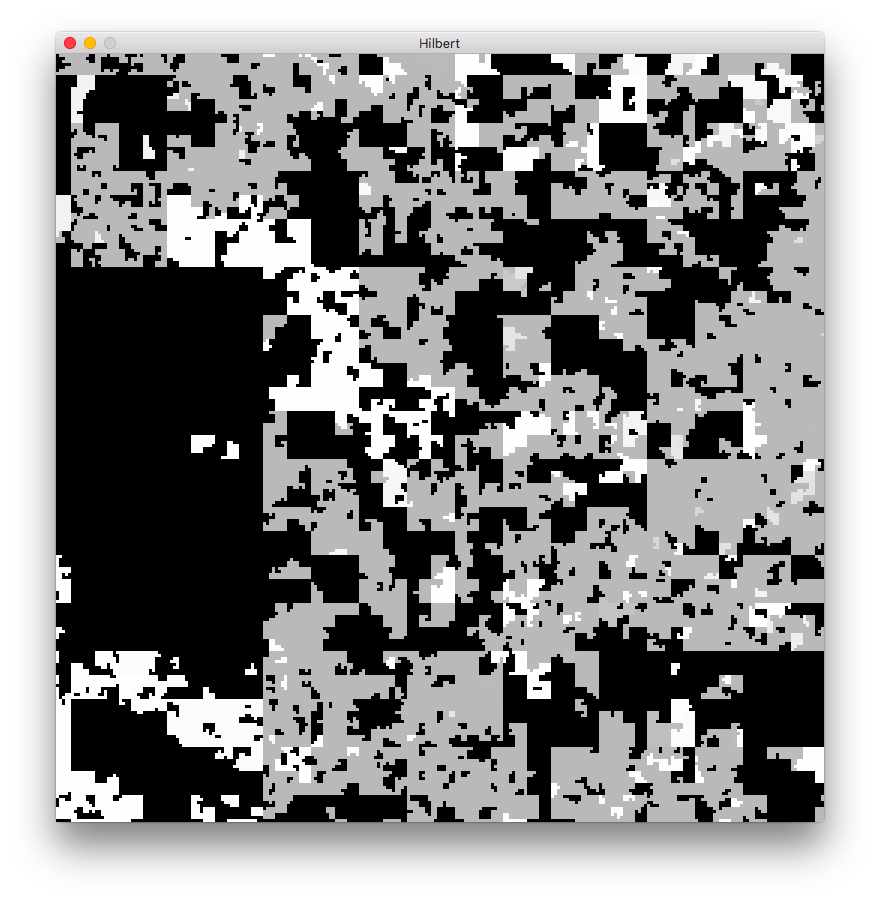

SDL-based hilbert curve visualizer for kernel coverage data.

It looks like this:

Input is a file with lines like:

    0x80124415  34
    0x80124419  4
    0x80194415  1
    0x80194416  257

Representing the number of times each kernel address was seen. Currently
all kernel addresses must be in the range 0x80000000-0xFFFFFFFF (the
default for 32-bit Windows systems).

Because the hilbert curve for a 2GB range of memory is quite large, the
viewer just shows a view into it, initially centered on a random
address. The colors (greyscale, going from black to white), represent
how rare a given address is, with white being the most rare. Black means
the address was never seen (yes, this is inconsistent, but worked better
than having the view be mostly white all the time). Specifically the
color is just 255 * (1 - frequency).

Inside the viewer, you can use the following keyboard commands:

* **Arrow keys** - pan around the viewport
* **q** - quit the viewer
* **r** - recenter the view on a random (nonzero count) address

You can click on any part of the viewport to display the actual address
and count.

Building
--------

On OS X, assuming you have [SDL
1.2](https://www.libsdl.org/download-1.2.php) installed to
`/Library/Frameworks/` you should be able to just type `make`.

On Linux it should compile with:

`g++ hilbert.cpp -o hilbert -lSDL -lbsd`

On Windows, you're on your own.

Bugs
----

The screen starts off blank until you use the arrow keys or press "r" to
move. I have no idea why and very little interest in figuring it out.
